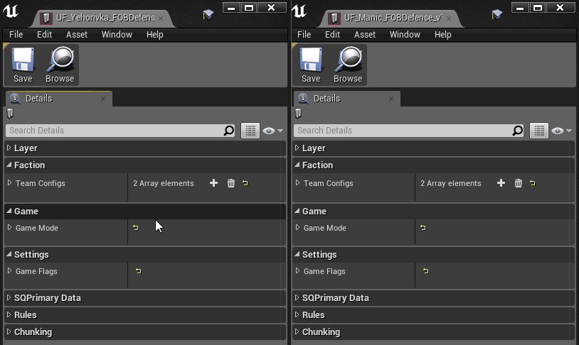

# FOB Defense Layers

Luckily, most of the hard work is done, I've setup the gamemode and custom assets to be as inclusive as possible.

## Creating a modded layer

Check out [the creating assets guide](/docs/creatingAssets.md) for how to create the modded layer. If this is your first layer in a level, you'll need to follow both the Copying a level and the Copying a layer guide.

## Finishing up the data asset

Once you have all the assets duplicated, open your data asset again, then open another, completed, FOBDefense data asset. i.e. `UnitedFrontEvents/Maps/Yehorivka/Gameplay_Layer_Data/UF_Yehorivka_FOBDefense_1`

If you open then side by side, you can right-click to copy and right-click to paste the team configs, game mode, and game flags data paths.

If for some reason the copy/paste method isn't working, pull them up side-by-side and copy the information manually. I also feel sorry for you because this has saved me hours of my life.

> @TODO
> - Open layer and alter to setup for FOB Defense
> - Check for lifetimes of temp spawns
> - Check for lifetimes of staging zones