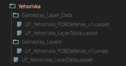

# Creating Assets

## Contents

- [Using this guide](#using-this-guide)
- [Copying a level](#copying-a-level)
- [Copying a layer](#copying-a-layer)
- [Appendix](#appendix)

### Using this guide:

Assets only explained in the [appendix](#appendix), only enough information is given to complete the task at hand. If referenced, those assets will have a link.

## Copying a level

Typically used when copying a layer, but it's the first time you're copying a level from the vanilla assets.

1. Include record in [level table](#level-table).
   - Easiest way to accomplish this is to copy from the vanilla level table entry, and paste into a duplicated entry in the modded level table.
2. Copy the [level data asset](#level-data-asset) from the vanilla directory to a [similar directory](#similar-directory) in the modded content.
   - Update `SQPrimary Data/Data` to reference your [level table entry](#level-table) and it's specific record.
2. Duplicate [layer table](#layer-table).
   - You can remove all the records, but I recommend keeping one just so you can edit it when you add your first layer.

## Copying a layer

Used to duplicate the map but customize how a layer works. This is the bread and butter of UnitedFrontEvents mod as we just want to reduce admin setup.

Create your layer name now, typically `UF_<level_name>_<gamemode_name>_v#`. Keep this in mind (or in your clipboard, I'll reference it as we go on.

1. Confirm that a level and all level assets exist for the duplicated layer, if not, [create one](#copying-a-layer).
1. Create an entry in your [layer table](#layer-table) referencing the layer name we just made, and what you want it to be displayed as.
2. Duplicate the [layer asset](#layer-level-asset) and place it into a [similar directory](#similar-directory) in the modded content folder. Rename it to your new layer name.
3. Duplicate the [layer data asset](#layer-data-asset), and update the following links:
   - `Layer/Worlds` to the [layer asset](#layer-level-asset) that you just duplicated.
	- Now is a great time to update your gamemode if you already have created one.
	- `SQPrimary Data/Data` to the [layer table](#layer-table) for this level, set the `row name` to the row that you created in step 2.
4. Save all your new assets and rename your [layer data asset](#layer-data-asset) to the name of your new layer. If we did this before now, UE4 would complain about broken references.

Once you're done, asset tree should look something like this (for a single layer):

# Appendix

Each record should include an example in the modded files (or vanilla if there isn't a modded one), as well as a short description. Enough information should be provided to understand what the asset does.

### Similar Directory

This reference is used when copying assets from the vanilla game.

***Ex:*** If you're copying the file `Game/Maps/Yehorivka/Yehorivka_Invasion_v1`, the asset should be copied to `UnitedFrontEvents/Maps/Yehorivka/UF_Yehorivka_Invasion_v1`

> ***Note:*** Vanilla content starts in the `game/` directory in the asset browser, this is the same as `content/` in the content browser.

> ***Note:*** All modded asssets should include `UF_` prepended to the name to distinguish between mods. Without this, Squad can crash or have more serious issues.

### Level Data Asset
`UnitedFrontEvents/Maps/Yehorivka/UF_Yehorivka_LevelData`

Meta data for the level including location on the planet.

Links to the `LevelTable` table.

### Level Table
`UnitedFrontEvents/Settings/UF_LevelTable`

Contains more meta data on each layer including thumbnails, lore, loading sounds, and default minimap.

### Layer Data Asset
`UnitedFrontEvents/Maps/Yehorika/Gameplay_Layer_Data/UF_Yehorivka_FOBDefense_v1`

Controls configuration settings for the layer.

- FOB build and exclusion radius
- Team/Faction configurations
- Game mode
- Game flags like disable vehicle claiming or you can force no commander cooldowns

Links to the `GameModeTable`, `LayerTable`, and `FobExclusionRadius` tables.

### Layer Table
`UnitedFrontEvents/Maps/Yehorika/Gameplay_Layer_Data/UF_Yehorivka_LayerTable`

Maps the layer name to the display name. Can also be overridden by the world value.

### Layer Level Asset
`UnitedFrontEvents/Maps/Yehorivka/Gameplay_Layers/UF_Yehorivka/ROBDefense_v1`

Level asset for the layer. This links to the master level in `Content/Maps/Yehorivka/Yehorivka_Single_Landscape`, if you edit the landscape or buildings in the layer this will also need to be copied over. For most modded layers, it's wise to not alter this as the asset is large and will inflate your mod size.