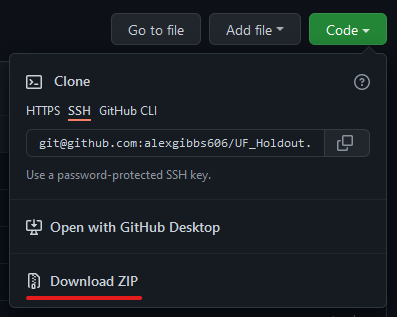
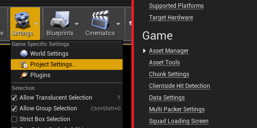
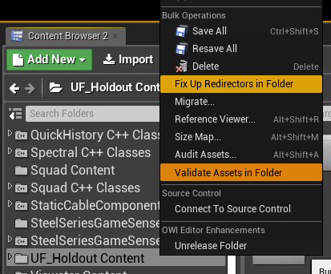

# UF_Holdout

***Symmetric USA vs. RUS one-life FOB defence with unlimited attacker spawns.***

US defenders are to maintain control of FOB at Sokolov from sqarming RUS forces. They have 40 minutes to take the point.  
One-life US defends against an unrelenting RUS force at Sokolov, the US's last remaining FOB in the area. US will get the 8 minute staging phase to construct non-lethal emplacements (save .50 cal) to defend against the attack.

## Contributing

If you're going to contribute, send me a message on discord and let me know what you plan on doing. Don't be lazy, put things in the correct directory, and only edit current files if necessary. Make a pull request and I'll do my best to get to it ASAP.

For most sections, there is a 'quickly' section that lists what you need to do as a reminder if you've done it before and just need a checklist.

- [Squad SDK Setup](#squad-sdk-setup)
- [Asset Manager Setup](#asset-manager-setup)
- [Cooking](#cooking)

### Squad SDK Setup

If you have the SDK installed, skip this paragraph. To get the SDK installed, you'll want to start by downloading the [Epic Games Launcher](https://www.epicgames.com/store/en-US/download) (yes, it's required). Once you have it all downloaded and you're signed in, find the [Squad Editor](https://www.epicgames.com/store/en-US/p/squad) on the Epic Games Store by clicking the provided link or searching for it on the store.

Once installed, you'll need to verify your Squad SDK files through the Epic Games Launcher. This will remove any other mod data in the Squad SDK, so remember to save your content if you're working on something else. I would still recommend doing this even if you've just installed it, it doesn't that THAT long and it may save from some headache later in the event something was install incorrectly.

Now we're gonna get into the editor. Launch the editor just by clicking it in your library, for first time users, your initial launch might take up to 5-10 min depending on your PC, be patient. If it's taking more than that, consider killing the process and relaunching.

Now we should have our editor up and running, the first thing we're gonna do it get our mod content from GitHub. If you're unfamiliar with Git and don't feel like using it, you can always head over to the GitHub page and download a zip from the 'Code' button in the top right corner.



Otherwise, clone this repo into the path `SquadEditor/Squad/Plugins/Mods/`

```console
AleX@yennefer MINGW64 /f/SquadEditor/Squad/Plugins/Mods
$ git clone git@github.com:alexgibbs606/UF_Holdout.git
Cloning into 'UF_Holdout'...
Enter passphrase for key '/c/Users/AleX/.ssh/id_rsa':
remote: Enumerating objects: 124, done.
remote: Counting objects: 100% (124/124), done.
remote: Compressing objects: 100% (81/81), done.
remote: Total 124 (delta 17), reused 121 (delta 14), pack-reused 0
Receiving objects: 100% (124/124), 6.93 MiB | 13.24 MiB/s, done.
Resolving deltas: 100% (17/17), done.

AleX@yennefer MINGW64 /f/SquadEditor/Squad/Plugins/Mods
$ ll
total 4
drwxr-xr-x 1 AleX 197121 0 Nov 26 11:07 UF_Holdout/
```

#### Quickly

- Install SDK
- Verify SDK files
- Clone repo into `SquadEditor/Squad/Plugins/Mods/`


### Asset Manager Setup

Now that you have the code, you'll need to link your assets before you build as we don't track that information in the repository. Open up the project settings, then "Asset Manager" on the left side under "Game".



In each array element, you'll edit the 'Directories' element to point as the same directory that the CAF DLC is pointing at. In this example, I'm doing it for the `UF_Holdout` mod.


***Note:** Element 0 should not be edited*

Continue with these changes, elements 1 and 2 should point to the maps directory, elements 3 and 4 should point to the Settings directory.

### Cooking

Only continue to this step once you're finished with your development or alterations.

Many of these steps are repeated to prevent UE4 from erroring out and/or causing issues.

1. Save your work and close the editor
2. Delete folders and all of their contents:
```
  ./SquadEditor/Squad/DerivedDataCache/
  ./SquadEditor/Squad/Intermediate/
  ./SquadEditor/Squad/ModSDK/
  ./SquadEditor/Squad/Saved/
  ./SquadEditor/Squad/Plugins/Mods/UnitedFrontEvents/Saved/
```
3. Open squad editor
4. Right click mod content folder, then fix-up and validate files  

5. Load mod from the modding panel, and package the mod.
6. Once you get the success message, you can publish and test it
